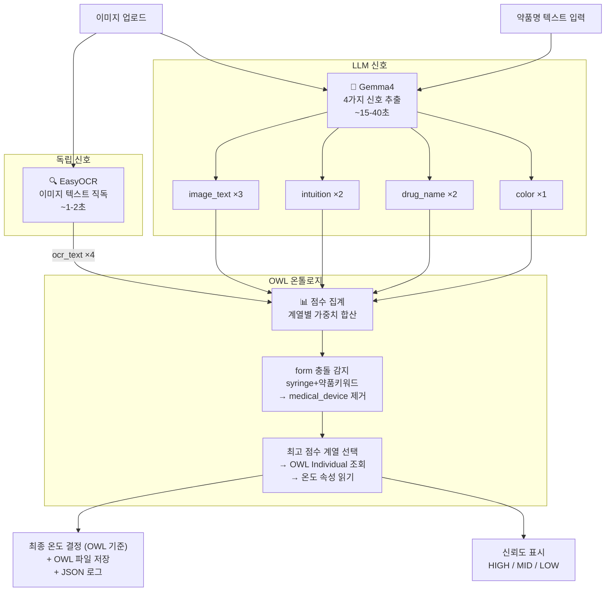

# 💊 Drug Storage Temperature Classifier

> **2026학년도 ICT(항공드론) 창업메이커톤** 시연용 코드 — 팀 쿨항대  
> 드론을 활용한 의약품 배송 시스템에서 **약품별 적정 보관 온도를 자동 판별**하는 AI 모듈입니다.  
> 이미지 또는 약품명만으로 냉장·상온·냉동 여부를 분류하고, 드론 탑재 냉온장 컨테이너의 온도 설정값을 자동 산출합니다.  
> 📋 [팀 노션](https://bottlenose-fiber-1f8.notion.site/2026-ict-b595f24a5b7182fd955301dd30abf628)

약품 이미지 또는 약품명을 입력하면 **적정 보관 온도**를 자동으로 분석하는 완전 로컬 AI 대시보드입니다.

[](https://youtu.be/6dkbLbDoTno)


---

## 시스템 구조



---

## OWL 온톨로지 독립 구현

LLM과 온톨로지를 완전히 분리하는 것이 핵심 설계 목표였습니다.

### 기존 방식의 문제

```
LLM → category 반환 → 온톨로지 룩업
```

LLM이 잘못된 category를 반환하면 온톨로지도 같이 틀립니다. 온톨로지가 LLM의 출력에 종속됩니다.

### 독립 구현 방식

```
EasyOCR (LLM과 무관) ──────────────────┐
LLM image_text ────────────────────────┤
LLM intuition  ────────────────────────┼──▶ OWL 온톨로지 점수 집계 ──▶ 최종 온도
LLM drug_name  ────────────────────────┤         (다수결)
LLM color      ────────────────────────┘
```

- **EasyOCR**가 이미지에서 직접 텍스트를 추출합니다 (LLM 완전 독립, 가중치 ×4 최우선)
- OWL 온톨로지는 LLM의 단일 판단이 아닌 **5가지 신호의 키워드 점수 합산**으로 계열을 결정합니다
- 점수가 모두 0일 때만 LLM category를 fallback으로 사용합니다

### OWL 구조 (owlready2)

```
Drug  ← 상위 클래스
  ├── InsulinDrug       min_temp=2,  max_temp=8
  ├── VaccineBiologic   min_temp=2,  max_temp=8
  ├── BloodProduct      min_temp=2,  max_temp=6
  ├── ChemoHormone      min_temp=2,  max_temp=8
  ├── Antibiotic        min_temp=15, max_temp=25
  ├── Analgesic         min_temp=15, max_temp=25
  ├── Vitamin           min_temp=15, max_temp=25
  ├── GeneralOral       min_temp=15, max_temp=25
  └── MedicalDevice     min_temp=15, max_temp=30

DataProperty: min_temp, max_temp, drug_description (FunctionalProperty)
```

분석 완료 시 `drug_ontology.owl` (RDF/XML)이 저장됩니다. Protégé에서 열람 가능합니다.

---

## 처리 시간

| 단계 | 소요 시간 |
|---|---|
| EasyOCR (최초 1회 모델 로드 포함) | ~10초 |
| EasyOCR (이후) | ~1-2초 |
| **Gemma4 LLM** ← 병목 | **~15-40초** |
| OWL 점수 집계 + 저장 | 무시 가능 |
| **총합** | **~17-42초** |

EasyOCR는 이미지 업로드 즉시 백그라운드 실행 → LLM과 겹치지 않음.

---

## LLM 오류 감소 전략

| 문제 | 해결 |
|---|---|
| 주사기 이미지에서 인슐린을 `medical_device`로 오분류 | form 충돌 감지 — 기기 형태여도 약품 키워드 점수가 있으면 medical_device 제거 |
| LLM category 하나에 온톨로지가 종속됨 | OCR 독립 신호(×4) 포함 5개 신호 다수결로 LLM category 의존도 제거 |
| JSON 앞뒤 설명 텍스트 추가 | 시스템 프롬프트 + PROMPT 양쪽 이중 강제 |
| 신뢰도 LOW 남발 | HIGH/MID/LOW 기준을 프롬프트에 명시 |
| 파싱 실패 | 코드블록 제거 → `json.loads` → 정규식 2단계 파싱 |

---

## 온톨로지 계열 (9개)

| 계열 | 보관 온도 | 색상 신호 |
|---|---|---|
| `insulin` | 2~8°C | 투명 |
| `vaccine_biologic` | 2~8°C | — |
| `blood_product` | 2~6°C | 암적색·maroon |
| `chemo_hormone` | 2~8°C | — |
| `antibiotic` | 15~25°C | — |
| `analgesic` | 15~25°C | — |
| `vitamin` | 15~25°C | 오렌지·노란 |
| `general_oral` | 15~25°C | — |
| `medical_device` | 15~30°C | — |

미분류 기본값: **2~8°C**

---

## 설치 및 실행

```bash
ollama pull gemma4
pip install -r requirements.txt
streamlit run app.py
```

> Ollama 서버(`localhost:11434`)가 먼저 실행 중이어야 합니다.  
> Gemma4 모델 용량: 약 9.6GB / 최소 RAM 6.7GiB

---

## 주의사항

- 본 시스템은 **참고용**이며 실제 의약품 보관은 반드시 공식 지침을 따르세요
- Ollama `system` 필드 사용 시 Gemma4 thinking이 깨짐 → 시스템 지시는 프롬프트에 직접 삽입

---

## 팀 정보

| | |
|---|---|
| 대회 | 2026학년도 ICT(항공드론) 창업메이커톤 |
| 팀명 | 쿨항대 |
| 노션 | [팀 페이지](https://bottlenose-fiber-1f8.notion.site/2026-ict-b595f24a5b7182fd955301dd30abf628) |
