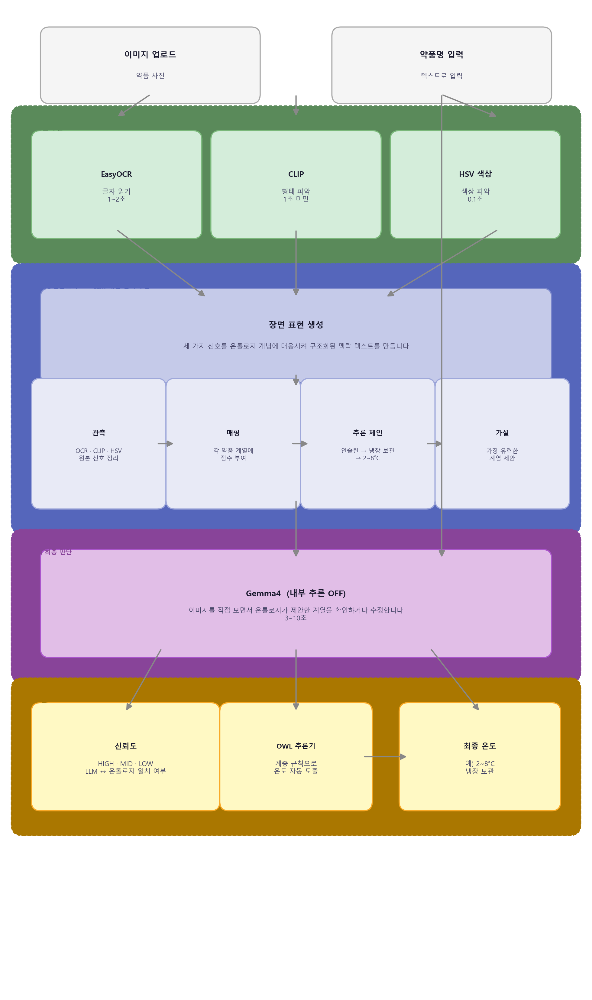

# 💊 Drug Storage Temperature Classifier

> **2026학년도 ICT(항공드론) 창업메이커톤** 시연용 코드 — 팀 쿨항대  
> 드론을 활용한 의약품 배송 시스템에서 **약품별 적정 보관 온도를 자동 판별**하는 AI 모듈입니다.  
> 이미지 또는 약품명만으로 냉장·상온 여부를 분류하고, 드론 탑재 냉온장 컨테이너의 온도 설정값을 자동 산출합니다.  
> 📋 [팀 노션](https://plausible-hallway-e4f.notion.site/081454b08de282e2b47d81c98ff5e3e8?source=copy_link)

[](https://youtu.be/6dkbLbDoTno)


---

## 시스템 구조



---

## 동작 방식

> 참조 논문: *Ontology-based prompting with LLMs for inferring construction activities from construction images*

이 시스템은 **온톨로지가 먼저 추론하고, VLM이 그 결과를 참조해 최종 판단**하는 구조입니다.  
LLM의 내부 추론(`think`)을 끄는 대신, 온톨로지가 미리 계산한 근거를 프롬프트에 주입합니다.

온톨로지가 틀려도 VLM이 검증해 잡아내는 구조이고, 지연시간과 정확도를 대폭 상승시켰습니다.

```
이미지
 ├─ EasyOCR    → 텍스트 신호
 ├─ CLIP       → 형태 신호 (자유문 설명)
 └─ HSV        → 색상 신호
        ↓
  build_scene_repr() — Symbolic Scene Representation 생성
  (관측 → 온톨로지 매핑 → 추론 체인 → 가설)
        ↓
  Gemma4 VLM — 장면 표현을 참조해 최종 계열 판단 (think: False)
        ↓
  classify_drug() — LLM 출력 vs 키워드 스코어 비교 → confidence + OWL 추론 → 온도 반환
```

| 구성요소 | 역할 |
|---|---|
| EasyOCR | 이미지 텍스트 추출 |
| CLIP | 약품 형태 인식 (펜형·바이알·혈액백 등, 자유문 반환) |
| HSV 색상 추출 | 지배 색상 판별 |
| OWL 추론기 | 신호 스코어링 → Symbolic Scene Representation 생성 → LLM에 맥락 주입 |
| Gemma4 VLM | 이미지 + 온톨로지 맥락 참조 → 최종 계열 판단 |
| OWL 분류기 | LLM 계열 결과 → HermiT 추론 → 보관 온도 도출 |

---

## Symbolic Scene Representation

온톨로지는 LLM에 다음과 같은 구조화된 맥락을 제공합니다.  
LLM은 이 정보를 보고 "확인 또는 오버라이드"만 수행하므로, 별도 내부 추론 없이도 정확한 판단이 가능합니다.

```
[약품 장면 표현 (Symbolic Scene Representation)]

── 관측 ──────────────────────────────────────
텍스트 (OCR)  : "인슐린 NovoRapid"
형태 (CLIP)   : "an elongated pen-shaped insulin injection device"
색상 (HSV)    : white

── 온톨로지 매핑 ──────────────────────────────
  insulin            ●●●    3점  ← 최고점
  vaccine_biologic   ●      1점

── 추론 체인 ──────────────────────────────────
InsulinDrug ← hasCategoryInd = cat_insulin
  ↓ (∈ ColdChainDrug)
  requiresStorage = Refrigerated
  → 예상 보관 온도: 2°C ~ 8°C

── 가설 ───────────────────────────────────────
insulin (인슐린 계열) — 이미지로 직접 확인 후 최종 판단하세요.
```

---

## 온톨로지의 3가지 역할

단순한 딕셔너리 대신 OWL 온톨로지를 사용하는 이유는, 하나의 온톨로지가 세 가지 역할을 동시에 수행하기 때문입니다.

### 1. 보관 온도 DB

냉장·상온·혈액·기기 등 보관 조건별 온도 범위를 온톨로지 안에 저장합니다.
온도를 수정할 때 코드를 뒤질 필요 없이 온톨로지만 바꾸면 됩니다.

| 보관 조건 | 온도 범위 |
|---|---|
| 냉장 (Refrigerated) | 2°C \~ 8°C |
| 혈액 (BloodStorage) | 2°C \~ 6°C |
| 상온 (RoomTemp) | 15°C \~ 25°C |
| 기기 (DeviceTemp) | 15°C \~ 30°C |

### 2. LLM 사전 추론기

CLIP·OCR·HSV 신호를 온톨로지 개념에 매핑해 Symbolic Scene Representation을 생성합니다.  
LLM이 호출되기 전에 가설과 근거를 먼저 계산해두므로, LLM은 내부 추론(`think`) 없이도 정확한 판단이 가능합니다.

### 3. 약품 분류기

LLM이 출력한 계열명을 받아 HermiT 추론기가 보관 온도를 자동 도출합니다.
인슐린 계열 → 냉장 보관 약품 → 2~8°C 순서로 클래스 계층을 따라 결론이 자동 상속됩니다.
개발자가 매핑 테이블을 직접 관리하지 않아도 됩니다.

---

## OWL 온톨로지 구조

```
Thing
├── StorageCondition          ← 보관 온도 DB
│    ├── Refrigerated  (2~8°C)
│    ├── BloodStorage  (2~6°C)
│    ├── RoomTemp      (15~25°C)
│    └── DeviceTemp    (15~30°C)
│
├── DrugCategory              ← LLM 출력을 OWL 개체로 변환
│    └── cat_insulin, cat_vaccine_biologic, cat_blood_product,
│        cat_chemo_hormone, cat_antibiotic, cat_analgesic,
│        cat_vitamin, cat_general_oral, cat_medical_device
│
└── Drug
     ├── ColdChainDrug  → requiresStorage = Refrigerated
     │    ├── InsulinDrug     ≡ Drug & hasCategoryInd = cat_insulin
     │    ├── VaccineBiologic ≡ Drug & hasCategoryInd = cat_vaccine_biologic
     │    └── ChemoHormone    ≡ Drug & hasCategoryInd = cat_chemo_hormone
     ├── RoomTempDrug   → requiresStorage = RoomTemp
     │    ├── Antibiotic  ≡ Drug & hasCategoryInd = cat_antibiotic
     │    ├── Analgesic   ≡ Drug & hasCategoryInd = cat_analgesic
     │    ├── Vitamin     ≡ Drug & hasCategoryInd = cat_vitamin
     │    └── GeneralOral ≡ Drug & hasCategoryInd = cat_general_oral
     ├── BloodProduct   → requiresStorage = BloodStorage
     │    └── ≡ Drug & hasCategoryInd = cat_blood_product
     └── MedicalDevice  → requiresStorage = DeviceTemp
          └── ≡ Drug & hasCategoryInd = cat_medical_device
```

**`≡` (equivalent_to)** 는 OWL 필요충분조건입니다.  
`InsulinDrug ≡ Drug & hasCategoryInd = cat_insulin` 의 의미:  
→ `cat_insulin` 신호가 주입된 Drug 개체를 추론기가 자동으로 `InsulinDrug`으로 분류합니다.  
→ 개발자가 온도를 직접 지정하지 않아도, 클래스 계층(`InsulinDrug → ColdChainDrug → Refrigerated`)을 따라 자동 도출됩니다.

분석 완료 시 `drug_ontology.owl` (RDF/XML)로 저장됩니다. Protégé에서 열람 가능합니다.

---

## 지원 계열 (9개)

| 계열 | 보관 온도 |
|---|---|
| `insulin` | 2°C \~ 8°C |
| `vaccine_biologic` | 2°C \~ 8°C |
| `chemo_hormone` | 2°C \~ 8°C |
| `blood_product` | 2°C \~ 6°C |
| `antibiotic` | 15°C \~ 25°C |
| `analgesic` | 15°C \~ 25°C |
| `vitamin` | 15°C \~ 25°C |
| `general_oral` | 15°C \~ 25°C |
| `medical_device` | 15°C \~ 30°C |

미분류 기본값: **2°C \~ 8°C** (안전 우선)

---

## 처리 시간

| 단계 | 소요 시간 |
|---|---|
| EasyOCR | 약 1\~2초 |
| CLIP 형태 인식 | 1초 미만 |
| HSV 색상 추출 | 약 0.1초 |
| OWL 추론기 (장면 표현 생성) | 약 0.1초 미만 |
| **Gemma4 VLM** ← 병목 | **약 3\~10초** |
| OWL 분류기 (온도 도출 · HermiT) | 약 0.5\~1초 |
| **총합** | **약 5\~14초** |

- OCR·CLIP·색상 추출은 이미지 업로드 즉시 실행 → LLM 호출 전 완료  
- LLM `think: False` — 내부 추론 생략, 온톨로지 맥락으로 대체  
- LLM 출력을 enum으로 고정해 생성 토큰 수 최소화

<details>
<summary>v1.0.0 처리 시간 (비교)</summary>

| 단계 | 최초 실행 | 이후 실행 |
|---|---|---|
| EasyOCR 모델 로드 | ~8초 | 0초 (캐시) |
| EasyOCR 텍스트 추출 | ~1\~2초 | ~1\~2초 |
| **Gemma4 VLM** ← 병목 | **~30\~40초** | **~30\~40초** |
| OWL 점수 집계 | <0.1초 | <0.1초 |
| **총합** | **~39\~50초** | **~31\~42초** |

온톨로지 사전추론 없이 LLM이 직접 추론 → `think: True` 상태로 내부 추론 수행
</details>

---

## 설치 및 실행

```bash
ollama pull gemma4:e4b
pip install -r requirements.txt
streamlit run app.py
```

> Ollama 서버(`localhost:11434`)가 먼저 실행 중이어야 합니다.  
> Gemma4 모델 용량: 약 9.6GB / 최소 RAM 6.7GiB  
> Java 17 필요 (HermiT 추론기 실행용)

---

## 주의사항

- 본 시스템은 **참고용**이며 실제 의약품 보관은 반드시 공식 지침을 따르세요
- LLM이 잘못된 계열을 출력하면 온톨로지 추론 결과도 틀릴 수 있습니다 — 신뢰도 LOW 시 직접 확인하세요
